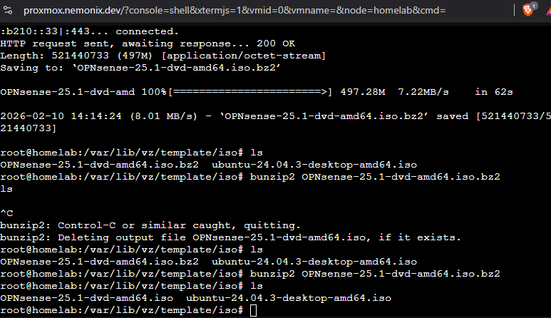
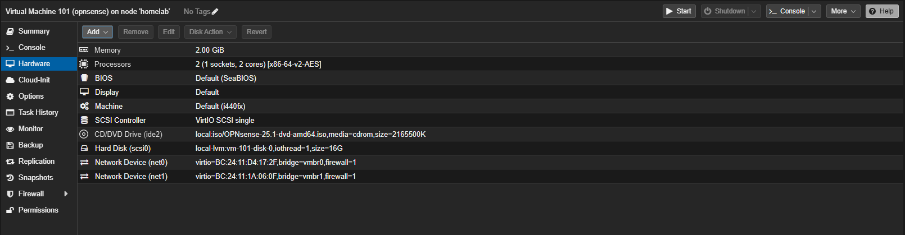
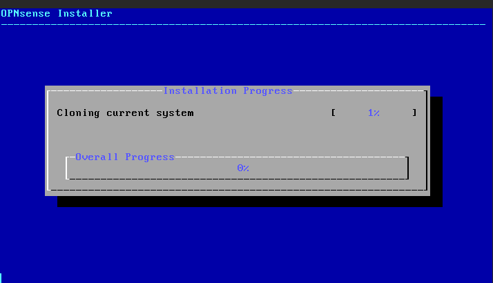
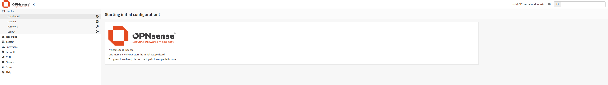
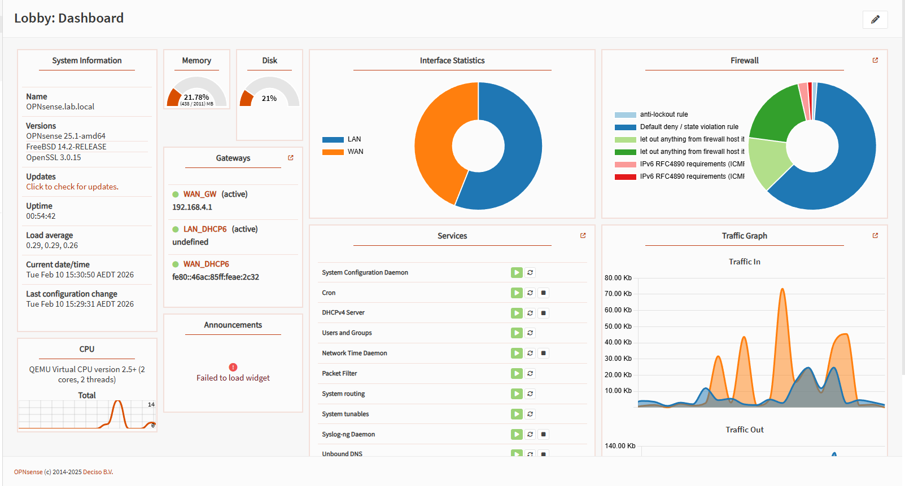
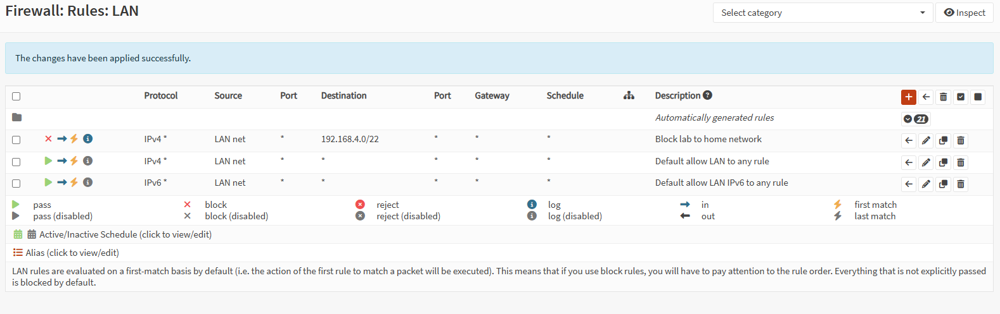

# Phase 0: Building a Proper Network Before Touching Any Code

Before I wrote a single line of code for NexOps, I needed to sort out my network. I'm running a Proxmox homelab on a mini PC that's exposed to the internet through Cloudflare Tunnel, and everything was sitting on my home network — right next to my personal laptop and phone. If any service I deploy gets compromised, that's game over for every device in the house.

So phase 0 was all about network isolation, firewall setup, and secure remote access. Here's how it went, including the stuff that broke.

## The Hardware

I'm running a **GMKtec M7 Mini PC** with two Intel I226-V 2.5GbE NICs. That's the key detail — two physical network ports means I can physically separate traffic.

- **NIC 1 (nic0)** → connected to my eero router → home network
- **NIC 2 (nic1)** → internal-only bridge → lab network

In Proxmox, these map to two Linux bridges:
- `vmbr0` on nic0 — carries home network and internet traffic
- `vmbr1` on nic1 — completely isolated virtual bridge for lab VMs

I actually started with both NICs plugged into the same switch, which turned out to be a mistake. More on that later.

## Setting Up OPNsense

First thing I needed was a firewall sitting between the two networks. I went with OPNsense — it's free, open-source, runs as a VM on Proxmox, and has a decent web UI for someone who's still learning firewalls.

Downloaded the ISO directly on the Proxmox host:

```bash
cd /var/lib/vz/template/iso/
wget "https://mirror.ams1.nl.leaseweb.net/opnsense/releases/25.1/OPNsense-25.1-dvd-amd64.iso.bz2"
bunzip2 OPNsense-25.1-dvd-amd64.iso.bz2
```



Created the VM with 2 cores, 2GB RAM, 16GB disk. The important part was the network setup — I gave it **two NICs**: `net0` on `vmbr0` (WAN side, home network) and `net1` on `vmbr1` (LAN side, lab network).



Installation was straightforward. Boot the ISO, log in as `installer` with password `opnsense`, let it clone to disk.



## First Problem: WAN and LAN Were Swapped

After the install, OPNsense assigned the interfaces backwards — what it called LAN was actually on my WAN bridge and vice versa. The console showed the wrong IPs on the wrong interfaces.

Fixed it by going into option `1) Assign interfaces` on the console and manually swapping them:
- WAN → `vtnet0` (vmbr0, home network)
- LAN → `vtnet1` (vmbr1, lab network)

Then set the LAN IP to `10.10.10.1/24` — a completely different subnet from my home network (`192.168.4.0/22`), zero overlap.


## Getting Into the Web UI (The SSH Tunnel Trick)

Here's a thing that tripped me up: OPNsense's web UI listens on the LAN interface (`10.10.10.1`). But my laptop is on the home network (`192.168.4.x`). The whole point of this setup is that those two networks can't talk to each other directly. So... how do I access the admin panel?

The answer is using Proxmox as a middleman. Proxmox sits on the home network but also has access to the lab bridge. So I SSH into Proxmox and forward a local port through to OPNsense:

```bash
# First, give Proxmox a temporary IP on the lab network
# (run this on the Proxmox shell)
ip addr add 10.10.10.2/24 dev vmbr1

# Then from my laptop, create an SSH tunnel through Proxmox
ssh -L 8443:10.10.10.1:443 root@192.168.4.93
```

Then I just open `https://localhost:8443` in my browser and I'm in the OPNsense web GUI.

The `ip addr add` command is temporary — it doesn't survive reboots. That's fine because once WireGuard VPN is set up, I won't need this tunnel trick anymore.



## Configuring OPNsense

Ran through the initial wizard:
- Set DNS to Google (`8.8.8.8`) and Cloudflare (`1.1.1.1`)
- Disabled IPv6 on both interfaces — it was causing DNS resolution failures. I suspect my ISP's IPv6 path isn't fully working. `ping google.com` would fail but `ping 8.8.8.8` worked fine, which is the classic sign of a DNS-over-IPv6 issue.



### Firewall Rules

The most important rule: **lab cannot reach home network**. I created a block rule on the LAN interface that drops any traffic from the lab subnet (`10.10.10.0/24`) headed for the home subnet (`192.168.4.0/22`). Below that, a pass rule allows lab traffic to reach everything else (internet).

Rule order matters — OPNsense evaluates top to bottom and stops at the first match. Block rule goes first.



On the WAN side, I had to uncheck "Block private networks" and "Block bogon networks" because my WAN interface IS on a private network (home router assigns `192.168.4.96`). In a data center you'd leave those checked, but in a homelab-behind-a-home-router setup, they'll block all your traffic.

## Setting Up WireGuard VPN

I need secure access to the lab network when I'm away from home, or even just a cleaner way to access it than SSH tunnels. WireGuard is the modern answer — it's fast, simple, and the config is tiny.

Set up in OPNsense under VPN > WireGuard:
- Created an instance (`wg0`) listening on port `51820` with tunnel address `10.10.20.1/24`
- Added a peer for my laptop with allowed IP `10.10.20.2/32`
- Created a firewall rule on the WireGuard interface group to allow VPN clients to reach all networks

Client config on my laptop:

```ini
[Interface]
PrivateKey = <redacted>
Address = 10.10.20.2/32

[Peer]
PublicKey = <redacted>
PresharedKey = <redacted>
Endpoint = 192.168.4.96:51820
AllowedIPs = 10.10.10.0/24, 10.10.20.0/24
PersistentKeepalive = 25
```

This is a **split tunnel** setup — only lab (`10.10.10.0/24`) and VPN (`10.10.20.0/24`) traffic goes through the tunnel. Regular internet traffic still goes through my normal connection. No point routing Netflix through my firewall VM.

I also set up port forwarding on my eero router: UDP `51820` → `192.168.4.96` so I can connect from outside my home network using my public IP.

## The Debugging Nightmare: WireGuard State Violation

This was the hardest part of the entire phase and honestly the part I learned the most from.

**The problem:** After setting everything up, WireGuard wouldn't connect. The handshake just hung. `wg show` on OPNsense showed 0 bytes received.

**Step 1 — Is the traffic even arriving?**

```bash
tcpdump -i vtnet0 udp port 51820
```

Yes. Packets were hitting the interface. So the issue wasn't networking — it was the firewall.

**Step 2 — Check the firewall logs.**

Opened the live firewall log in OPNsense's web UI. Saw the WireGuard packets being blocked with the label: `Default deny / state violation rule`.

"State violation" means OPNsense's packet filter (pf) saw a packet that didn't match any existing connection state and wasn't matched by any explicit pass rule. Weird, because I definitely had a rule allowing UDP 51820 on WAN.

**Step 3 — Try everything in the GUI.**

I created the rule with destination "WAN address." Didn't work. Changed it to "any." Didn't work. Created a floating rule with "sloppy state." Didn't work. Tried "no state." Still blocked.

**Step 4 — The nuclear test.**

```bash
pfctl -d   # disable the entire firewall
```

VPN connected instantly. Re-enabled:

```bash
pfctl -e   # re-enable firewall
```

Broken again. So the problem was definitively in pf — OPNsense's underlying packet filter was intercepting the packets before any of my GUI-configured rules were being evaluated.

**Step 5 — The fix.**

Injected a raw pf rule directly:

```bash
echo "pass in quick on vtnet0 proto udp to port 51820" | pfctl -mf -
```

The `quick` keyword means "match this immediately, don't evaluate further rules." This bypasses whatever ordering issue was causing the state violation.

VPN connected. Handshake completed. Traffic flowing.

**Step 6 — Make it survive reboots.**

Created a boot script at `/usr/local/etc/rc.syshook.d/early/50-wireguard-pf.sh`:

```bash
#!/bin/sh
sleep 10
echo "pass in quick on vtnet0 proto udp to port 51820" | pfctl -mf -
```

The `sleep 10` gives OPNsense time to load its own rules before we inject ours. Made it executable, rebooted, VPN still works.

This was probably 3-4 hours of debugging for what ended up being a one-line fix. But I now actually understand how pf works, what state tracking does, and why firewall rule evaluation order matters. That's the kind of thing you only learn by breaking stuff.

## The DHCP Conflict (Another Fun One)

Earlier I mentioned both NICs were on the same switch. That caused a problem I didn't expect: OPNsense's DHCP server on vmbr1 was handing out `10.10.10.x` addresses to devices on my home network. My phone suddenly had a `10.10.10.x` address and couldn't reach the internet.

The issue was that even though vmbr0 and vmbr1 are separate bridges in Proxmox, if both physical NICs are on the same switch, the switch broadcasts DHCP offers everywhere. OPNsense's LAN DHCP responses were leaking out through the physical switch to home devices.

Fixed it by unplugging nic1 from the switch entirely and making vmbr1 an internal-only bridge with no physical uplink. Lab VMs connect to it virtually — they don't need a physical cable because they're all running on the same Proxmox host.

## The Final Architecture

```
INTERNET
    |
    +-- Cloudflare Tunnel (public services)
    |       -> Proxmox (192.168.4.93)
    |
    +-- WireGuard VPN (private admin access)
            -> OPNsense WAN (192.168.4.96:51820)

HOME NETWORK (192.168.4.0/22)
    +-- Proxmox host (192.168.4.93) via vmbr0
    +-- Personal devices (laptop, phone, etc.)
    +-- OPNsense WAN interface (192.168.4.96)

LAB NETWORK (10.10.10.0/24) - internal bridge only
    +-- OPNsense LAN (10.10.10.1) - gateway/firewall
    +-- Future: K3s nodes, containers, NexOps services
    +-- DHCP range: 10.10.10.100-200

VPN NETWORK (10.10.20.0/24)
    +-- OPNsense tunnel (10.10.20.1)
    +-- My laptop (10.10.20.2)
```

Three isolated networks. Firewall controlling traffic between them. VPN for secure remote access. Cloudflare Tunnel for public services. This is the foundation that everything else gets built on.

## What's Next

- Set up dynamic DNS so `vpn.nemonix.dev` points to my public IP automatically
- Test VPN from outside my home network (mobile hotspot)
- Spin up the first lab VM to verify DHCP and internet access
- Deploy Traefik as the reverse proxy for services

## Tools I Used for Debugging

| Tool | What It Does |
|------|-------------|
| `tcpdump -i vtnet0 udp port 51820` | Capture packets on an interface — proved traffic was arriving |
| `pfctl -sr \| grep 51820` | Show active pf rules — check if my rule exists |
| `pfctl -d` / `pfctl -e` | Disable/enable firewall — nuclear option to isolate the problem |
| `pfctl -F states` | Flush firewall state table — clear stale connections |
| `wg show` | WireGuard status — showed 0 bytes received during debugging |
| `sockstat -l \| grep 51820` | Confirm WireGuard was actually listening on the port |
| OPNsense Live View | Real-time firewall log — saw "state violation" blocks |
