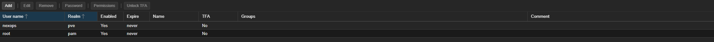
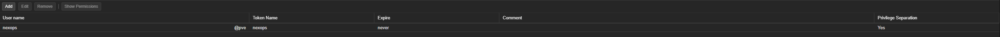
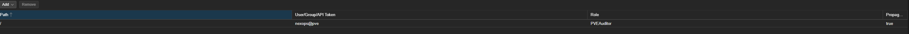
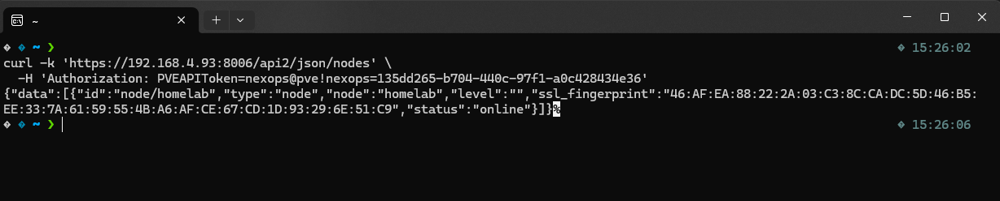
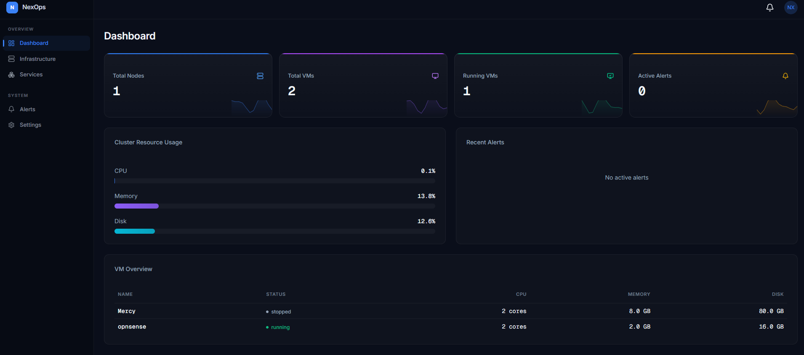
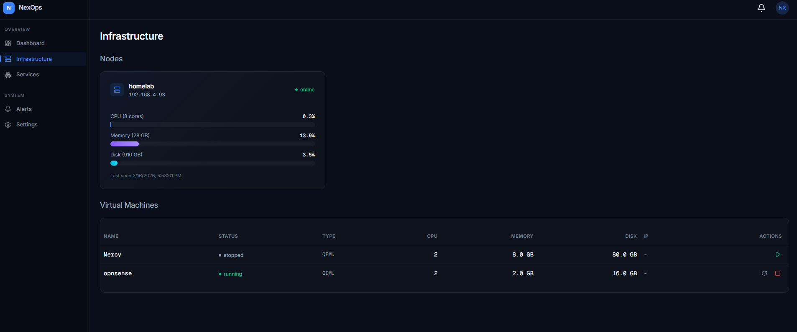
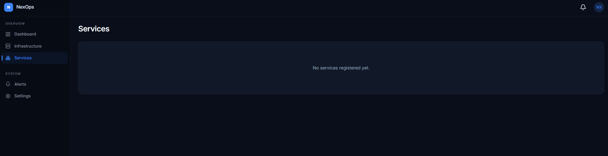
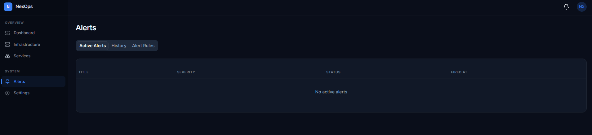
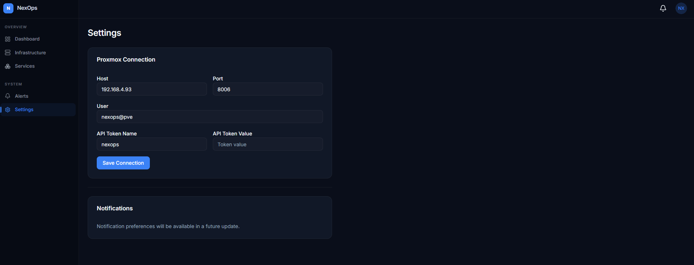

# Phase 1: Building the Actual App — NexOps Talks to Proxmox

After sorting out the network in Phase 0, it was time to build the thing. NexOps is supposed to be an infrastructure management platform, so the first real question was: how does a web app talk to a hypervisor?

Turns out Proxmox has a full REST API. You throw it an API token, it gives you back JSON with everything — nodes, VMs, resource usage, status. So the plan was simple: build a Next.js frontend and a FastAPI backend, connect them to the Proxmox API, and see my actual infrastructure in a dashboard I built myself.

## Setting Up Proxmox API Access (The Right Way)

First instinct was to just use my root credentials. That would work, but it's a terrible idea. If your app gets compromised, the attacker has full root access to your hypervisor. Not great.

So I did it properly — created a dedicated user with only the permissions the app actually needs.

### Step 1: Create a dedicated user

In the Proxmox web UI, went to Datacenter > Permissions > Users and created a new user `nexops@pve`. No password needed because this user will only authenticate via API tokens, never through the web UI.



### Step 2: Create an API token

Under Datacenter > Permissions > API Tokens, created a token for the `nexops@pve` user. Token name: `nexops`. The important setting here is **Privilege Separation** — I left it enabled (set to Yes), which means the token can only use permissions explicitly granted to it, not anything inherited from the user. It's an extra layer of control.



### Step 3: Assign minimal permissions

This is the part most tutorials skip. Instead of giving the user full admin access, I went to Datacenter > Permissions and assigned only what NexOps actually needs right now:

- **PVEAuditor** at path `/` with propagate enabled — this lets the app read everything (nodes, VMs, resource usage) but can't modify anything
- **PVEVMUser** — for basic VM operations (start, stop, restart) which I'll need later

That's it. The app can see my infrastructure and manage VMs, but it can't delete storage, modify the cluster, create users, or do anything destructive. Least privilege — if someone compromises the API token, the blast radius is limited.



### Step 4: Test the API

Before writing any app code, I wanted to make sure the token actually worked. Quick curl from my terminal:

```bash
curl -k 'https://192.168.4.93:8006/api2/json/nodes' \
  -H 'Authorization: PVEAPIToken=nexops@pve!nexops=<token-value>'
```

And it came back with my node data — `"node":"homelab"`, `"status":"online"`. We're in business.



The `-k` flag skips SSL verification because Proxmox uses a self-signed cert. In production you'd set up proper certs, but for a homelab talking to localhost, this is fine.

## Building the App

This part was honestly the smoothest phase so far. My background is in software development, so building a Next.js + FastAPI app isn't new territory. The interesting part was making it talk to real infrastructure instead of a database full of dummy data.

### The Backend (FastAPI)

The FastAPI backend acts as a middleman between the frontend and the Proxmox API. Why not call Proxmox directly from the frontend? Two reasons:

1. **Security** — the API token stays on the server, never exposed to the browser
2. **Abstraction** — the backend can normalize the data, add caching later, and eventually talk to multiple providers (AWS, Azure) through the same endpoints

The backend takes the Proxmox connection details (host, port, user, token) from the settings, makes API calls to Proxmox, and returns clean JSON to the frontend.

### The Frontend (Next.js)

Built a dark-themed dashboard with a sidebar navigation. Nothing fancy design-wise — function over form at this stage. The sidebar has two sections:

**Overview:**
- Dashboard — the main view with cluster stats
- Infrastructure — detailed node and VM info
- Services — placeholder for future service management

**System:**
- Alerts — placeholder for monitoring alerts
- Settings — Proxmox connection configuration

### What the Dashboard Actually Shows

The dashboard pulls real data from my Proxmox node through the API. When I open it, I see:

- **Total Nodes: 1** — my homelab node
- **Total VMs: 2** — Mercy (a test VM, currently stopped) and opnsense (the firewall from Phase 0, running)
- **Running VMs: 1** — just opnsense
- **Active Alerts: 0** — alerting isn't wired up yet
- **Cluster Resource Usage** — CPU at 0.1%, Memory at 13.8%, Disk at 12.6% (the GMKtec mini PC is barely breaking a sweat)
- **VM Overview** — a table showing each VM's name, status, CPU cores, memory, and disk



This isn't mock data. That 13.8% memory usage is real. The opnsense VM showing as "running" is real. If I stop a VM in Proxmox and refresh the dashboard, the numbers update.

### Infrastructure Page

Clicking into Infrastructure gives a more detailed view. It shows the node card for "homelab" at `192.168.4.93` with the full resource breakdown — 8 cores, 28GB RAM, 910GB disk. Below that, the VM table adds the hypervisor type (QEMU for both VMs) and action buttons. The running opnsense VM has restart and stop buttons; the stopped Mercy VM has a start button.



### The Other Pages

Services, Alerts, and Settings are built out but mostly waiting for future phases:

- **Services** shows "No services registered yet" — this'll come alive when I start deploying containers and K3s workloads



- **Alerts** has tabs for Active Alerts, History, and Alert Rules — all empty until I wire up Prometheus in Phase 7



- **Settings** is the one that's fully functional. This is where you configure the Proxmox connection — host, port, user, API token name and value. Hit "Save Connection" and the app connects. Notifications settings are a placeholder for now.



## Why This Matters (Beyond "I Built an App")

The app itself isn't groundbreaking — it's a dashboard that reads from an API. But the decisions around it are what matter:

- **Least privilege access** — didn't use root, created a scoped user with only the roles needed
- **API token with privilege separation** — even the token is restricted beyond the user's own permissions
- **Backend as API gateway** — keeps secrets server-side, sets up for multi-provider support later
- **Real data, not mocks** — the app manages actual running infrastructure, not a demo environment

This is the foundation that every future phase builds on. Docker containers I deploy will show up here. K3s pods will show up here. Terraform-provisioned VMs will show up here. It's not just an app — it's the management plane for everything that comes next.

## What's Next

Phase 2 is containerization. Right now the app runs directly on my machine with `npm run dev` and `uvicorn`. Next step is packaging it into Docker containers with proper multi-stage builds, docker-compose for local dev, and getting it deployed on the Proxmox lab network so I can access it through the firewall setup from Phase 0.
