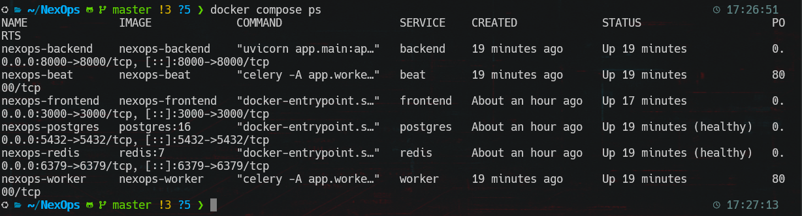
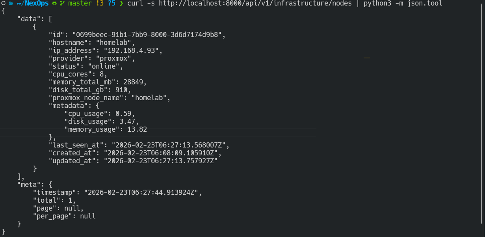
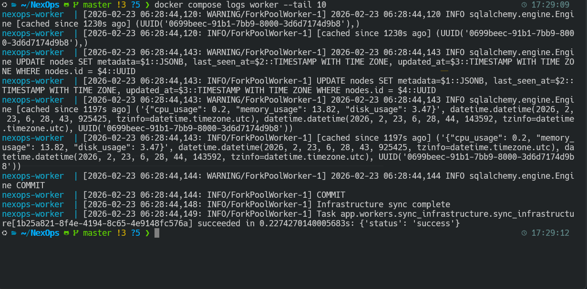

# Phase 2: Containerizing NexOps — 6 Services, Zero Root

I'll be honest — Docker isn't new to me. I've used it for years as a software developer. But "used it" is doing a lot of heavy lifting there. What I actually did was let ChatGPT generate a Dockerfile, copy-paste it into my project, run `docker compose up`, and move on with my life. I wanted to use the fancy tool with the whale logo. I never read the Dockerfile line by line. I couldn't tell you what `WORKDIR` did versus `COPY` versus `RUN`. It was a black box that made my app run, and that was enough.

This phase was completely different. I wrote every line of the Dockerfile by hand. Multi-stage builds, non-root users, health checks — I know exactly what each instruction does and why it's there. When the Celery Beat container crashed because of a permission issue, I didn't paste the error into an AI and wait for a fix. I read the logs, understood that non-root users can't write to root-owned directories, and figured out the solution.

And honestly? It reminded me of something I've been missing. Back before AI tools took over, there was this feeling you'd get — deep in your code, debugging something weird, copying a snippet from StackOverflow, breaking it down line by line to understand why it works. That satisfaction of actually *knowing* what your code does. Since AI, the workflow became "let the model write it, check if it works, ship it." Faster? Yeah. But you lose that connection to the code.

With the Dockerfiles and infrastructure stuff, I'm getting that feeling back. Reading each line, understanding the layers, knowing that when something breaks I can trace it because I built it myself. I'm genuinely hyped to keep going deeper into the DevOps space — Terraform is next and I already know it's going to be the same energy.

Phase 1 ended with a working app on my local machine — `npm run dev` for the frontend, `uvicorn` for the backend, PostgreSQL installed locally. It worked, but it was fragile. Different Python versions, missing system packages, "works on my machine" energy. Time to containerize everything properly.

The goal was to get the entire NexOps stack running in Docker containers with a single `docker compose up -d` command. No local dependencies except Docker itself.

## The Stack: 6 Services

NexOps isn't just a frontend and a backend. By the time I mapped out everything the app needs, I ended up with 6 services:

| Service | Image | What It Does |
|---------|-------|-------------|
| **postgres** | `postgres:16` | Database — stores nodes, VMs, metrics, alerts |
| **redis** | `redis:7` | Message broker for background tasks |
| **backend** | Custom (FastAPI) | API server — serves data to the frontend |
| **frontend** | Custom (Next.js) | Web UI — the dashboard |
| **worker** | Custom (Celery) | Background worker — polls Proxmox for live metrics |
| **beat** | Custom (Celery Beat) | Scheduler — triggers the worker on intervals |

The backend, worker, and beat all share the same Docker image (built from the same Dockerfile) but run different commands. The worker does the actual Proxmox polling, beat tells it when to poll, and the backend serves the results through the API.



## Multi-Stage Dockerfiles

I wrote multi-stage Dockerfiles for both the backend and frontend. The idea is simple: one stage has all the build tools (compilers, dev dependencies), and the final stage only has what's needed to run the app. Keeps images small and reduces the attack surface.

For the backend (FastAPI):
- **Build stage:** Install Python dependencies with pip
- **Production stage:** Copy only the installed packages and app code, no pip, no build tools

For the frontend (Next.js):
- **Build stage:** `npm install` + `npm run build`
- **Production stage:** Copy the `.next` build output and `node_modules`, no source code

Both final images run as a non-root user called `appuser`. This is a security best practice — if someone finds a way to execute code inside the container, they land as an unprivileged user, not root. It's the container equivalent of what I did with the Proxmox API token in Phase 1: least privilege.

## Docker Compose: Wiring It All Together

The `docker-compose.yml` ties everything together. A few things worth noting:

**Health checks** — Postgres and Redis have health checks (`pg_isready` and `redis-cli ping`). The backend, worker, and beat use `depends_on` with `condition: service_healthy` so they don't start until the database and cache are actually ready, not just "container is running." This prevents the classic race condition where your app starts before the database is accepting connections.

**Environment variables** — Everything sensitive (database password, Proxmox API token, secret keys) lives in a `.env` file at the project root. The compose file references it with `env_file: - .env`. Nothing hardcoded in images or committed to git.

**Port mapping** — Backend on `8000`, frontend on `3000`, Postgres on `5432`, Redis on `6379`. Standard ports, nothing fancy.

## The Bugs (And What They Taught Me)

This phase had four issues, and honestly each one taught me something specific about how Docker works.

### 1. Celery Beat: Permission Denied

**The problem:** The beat container crashed on startup with a permission error. Celery Beat writes a `celerybeat-schedule` file to track when it last ran each task. By default it writes to the current directory, which is `/app`. But `/app` is owned by root (it was created during the Docker build), and the container runs as `appuser`.

**The fix:** Tell beat to write the schedule file to `/tmp` instead:

```bash
celery -A app.workers.celery_app beat -l info --schedule=/tmp/celerybeat-schedule
```

`/tmp` is world-writable, so any user can write there. This is a common pattern when running containers as non-root — anything that needs to write temporary files goes to `/tmp`.

**The lesson:** Non-root containers are a security best practice, but you'll hit file permission issues. The fix is usually one of: write to `/tmp`, `chown` directories in the Dockerfile, or mount a volume with correct permissions.

### 2. Alembic: ModuleNotFoundError

**The problem:** Running database migrations with Alembic failed inside the container:

```
ModuleNotFoundError: No module named 'app'
```

Alembic's `env.py` has `from app.config import settings` at the top. On my local machine this works because Python can find the `app` package. Inside the Docker container, the working directory is `/app` but Python doesn't know to look there for imports.

**The fix:** Added one line to the second stage of the backend Dockerfile:

```dockerfile
ENV PYTHONPATH="/app"
```

This tells Python "when you're looking for modules, also check `/app`." Uvicorn handles this automatically (it adds the current directory to the path), but Alembic and Celery don't — they use standard Python import resolution.

**The lesson:** `PYTHONPATH` matters in Docker. Different tools resolve imports differently. When something works locally but fails in a container, missing environment variables are the first thing to check.

### 3. Database Tables Missing

**The problem:** Postgres was running and healthy, but the database was completely empty. The worker crashed with:

```
relation "nodes" does not exist
```

The container starts PostgreSQL and creates the `nexops` database, but it doesn't run migrations. The tables don't exist until you tell Alembic to create them.

**The fix:**

```bash
docker compose exec backend alembic upgrade head
```

This runs the migration inside the running backend container, creating all 8 tables (nodes, virtual_machines, metrics, alerts, etc.).

**The lesson:** Database containers create the database but NOT your schema. Migrations are a separate step. In production, this gets automated in CI/CD — but for now, it's a manual command after first boot.

### 4. Frontend Container Exiting

**The problem:** The frontend container started fine (logs showed "Ready in 94ms") then immediately exited.

**The fix:** It got stopped when I rebuilt the backend services. Just restarted it:

```bash
docker compose up -d frontend
```

Not a real bug, more of a "Docker Compose will sometimes stop dependent services during rebuilds" gotcha.

## The Result: Live Infrastructure Data from Docker

After fixing everything, `docker compose ps` shows all 6 services running with healthy statuses. But the real test is: does it actually work?

Hitting the API from the terminal:

```bash
curl -s http://localhost:8000/api/v1/infrastructure/nodes | python3 -m json.tool
```

Returns real data from my Proxmox node — hostname "homelab", IP `192.168.4.93`, 8 CPU cores, 28GB RAM, 910GB disk. CPU usage at 0.59%, memory at 13.82%, disk at 3.47%. All real, all live.



And the worker logs show it's actively syncing:

```
Infrastructure sync complete
Task app.workers.sync_infrastructure succeeded in 0.22s: {'status': 'success'}
```

The Celery worker connects to Proxmox through the API token I set up in Phase 1, pulls the latest metrics (CPU, memory, disk usage), and writes them to PostgreSQL. The beat scheduler triggers this sync on a regular interval. The backend reads from Postgres and serves it through the REST API. The frontend renders it in the dashboard.



The whole pipeline — from Proxmox hypervisor to browser dashboard — is now running entirely in Docker containers.

## Key Takeaways

A few things I'd want to remember:

- **Multi-stage builds** keep images small and secure — don't ship compilers in production
- **Non-root containers** are worth the friction — the permission issues are fixable, the security improvement isn't optional
- **Health checks + depends_on conditions** prevent race conditions at startup — don't just check if the container is running, check if the service inside is ready
- **`PYTHONPATH` in Docker** — tools like Alembic and Celery need it explicitly, even if uvicorn works without it
- **`.env` at project root** — Docker Compose reads it from where the compose file is, not from inside the service directory

## What's Next

The app is containerized, but it's still running on my local machine with `docker compose up`. Phase 3 is Terraform — using infrastructure as code to provision VMs on Proxmox and eventually cloud resources. The containers need a proper home on the lab network, not my laptop.
